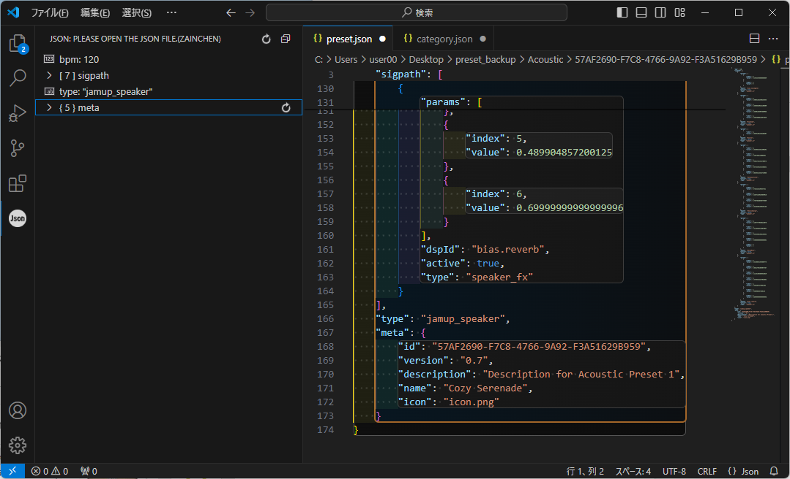

# SparkApp
[戻る](./README.md)
## 1.バックアップデータの概要
1. Dropbox に保存されたバックアップデータは、世代管理はされず、常に上書きされ、１つしか保存されない。
2. 世代管理したければ、Dropbox のバックアップデータを別途保管しておき、それを復元したいときはDropbox にアップロードして上書きすればよい。
3. Dropboxのフォルダ直下に「アプリ」->「Spark Amp」とフォルダが作られ、そのなかに「preset_backup.zip」としてバックアップされる。
4. 「preset_backup.zip」を解凍すると、「preset_backup」フォルダのなかに、プリセットのカテゴリ名（Pop、Rockなど）のフォルダが７つあり、「カテゴリ名フォルダ」のなかに、個々のプリセットのフォルダが格納されている。
5. 個々のプリセットのフォルダのフォルダ名は、「プリセットID」になっている。「プリセットID」は、「8-4-4-4-12文字」のランダム英数字である。
6. プリセットのフォルダのなかには、アイコン画像である「icon.png」ファイルと、プリセットの本体である「preset.json」ファイルが格納されている。
7. 「preset.json」はテキストファイルであり、開くとどういう設定になっているか、読むことができる。
8. iPad でバックアップしたデータを、Android 端末に復元することもできた。

## 2.バックアップデータの画像
| No | Images | Memo|
|---|---|---|
| 1  |  | Dropboxの「アプリ -> Spark amp」画面。「preset_backup.zip」ファイルがバックアップデータ。世代管理はされず、常に上書きされる。 |
| 2  |  | 「preset_backup」フォルダの中身。カテゴリ名のフォルダが格納されている。 |
| 3  |  | 「Acoustic」フォルダの中身。ひとつひとつのフォルダが、プリセットである。フォルダ名は、「プリセットＩＤ」で、システム内部での管理に使われている。「プリセット名」とはまた別である。「category.json」ファイルには、プリセットＩＤが書き込まれていて、各プリセットがアプリで表示される並び順は、このファイルに書かれている順である。 |
| 4  |  | プリセットのフォルダのなかには、アイコン画像である「icon.png」ファイルと、プリセットの本体である「preset.json」ファイルが格納されている。「preset.json」はテキストファイルであり、開くとどういう設定になっているか、読むことができる。|
  
## 3.バックアップ
| No | Images | Memo|
|---|---|---|
|1||「プリセット・カテゴリ」の各フォルダには「category.json」ファイルが１つずつあり、そのカテゴリに格納されているプリセットの「プリセットＩＤ」「バージョン」「名前」「アイコン画像のファイル名」「説明文」が書き込まれている。 各プリセットがアプリで表示される並び順は、このファイルに書かれている順である。|
|2||プリセットのフォルダのなかの「preset.json」ファイル。|
|3||全体として|
|4||各エフェクターの設定値|

[戻る](./README.md)