# SparkApp エフェクト 一覧
[戻る](./README.md)
## 1.GATE
  
| No | images | DSP ID| Name | index 0 | index 1 | index 2 |
|----|--------|----------------|------------|-----------|--------|----|
| 1  |  | bias.noisegate | NOISE GATE | Threshold | Decay | 不明 |
  
## 2.COMP/WAH
  
| No | Images | DSP ID | COMP/WAH  | 参照モデル  | index 0 | index 1  | index 2 | index 3 |
|----|--------|----------------|-----------------|-----------------------------|---------|----------------|------------------|---------|
| 1  |  | LA2AComp | 01 LA Comp| [Teletronix LA-2A Compressor](https://hookup.co.jp/products/universal-audio/uafx-teletronix-la-2a-studio-compressor) | GAIN | PEAK REDUCTION | LIMIT / COMPRESS ||
| 2  | 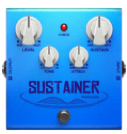 | BlueComp | 02 Sustain Comp | [Boss CS-3](https://www.boss.info/jp/products/cs-3/) | LEVEL| TONE  | ATTACK  | SUSTAIN |
| 3  | 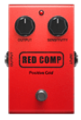 | Compressor  | 03 Red Comp  | [MXR Dyna Comp](https://moridaira.co.jp/posts/mxr-m102)| OUTPUT  | SENSITIVITY |||
| 4  | 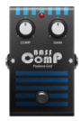 | BassComp | 04 Bass Comp | [EBS Multicomp](https://moridaira.co.jp/posts/ebs-multicomp-se) | COMP | GAIN  |||
| 5  | 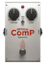 | BBEOpticalComp | 05 Optical Comp | BBE Opto Stomp  | VOLUME  | COMP  | PAD(-15dB/0dB)|
  
## 3.DRIVE
  
| No | Images | DSP ID | DRIVE | 参照モデル | index 0 | index 1 | index 2 |
|----|--------|-------------------|----------------|-----------------------------------|------------|-------------|-----------|
| 1  | 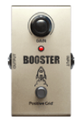 | Booster  | 01 Booster  | [MXR Micro Amp](https://moridaira.co.jp/posts/mxr-m133)| GAIN | |  |
| 2  | 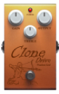 | KlonCentaurSilver | 02 Clone Drive | [Klon Centaur](https://www.digimart.net/magazine/article/2020061604033.html) | OUTPUT  | TREBLE| GAIN|
| 3  |  | DistortionTS9  | 03 Tube Drive  | [Ibanez Tube Screamer](https://www.ibanez.com/jp/products/model/tube_screamer/) | OVERDRIVE  | TONE  | LEVEL  |
| 4  | 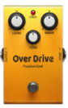 | Overdrive| 04 Over Drive  | [Boss OD-3](https://www.boss.info/jp/products/od-3/) | LEVEL| TONE  | DRIVE  |
| 5  | 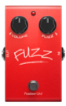 | Fuzz  | 09 Fuzz Face| [Dunlop or Arbiter Fuzz Face](https://moridaira.co.jp/posts/jdunlop-jhf1) | VOLUME  | FUZZ  |  |
| 6  |  | ProCoRat | 10 Black Op | [Pro Co RAT](https://moridaira.co.jp/proco)| DISTORTION | FILTER| VOLUME |
| 7  | 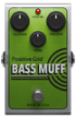 | BassBigMuff | 11 Bass Muff| [Electro Harmonix Bass Big Muff Pi](https://kcmusic.jp/ehx/bass_big_muff_pi/) | VOLUME  | TONE  | SUSTAIN|
| 8  |  | GuitarMuff  | 12 Guitar Muff | [Electro Harmonix Big Muff](https://kcmusic.jp/ehx/usbigmuff/)| VOLUME  | TONE  | SUSTAIN|
| 9  |  | MaestroBassmaster | 13 Bassmaster  | [Maestro Bass Brassmaster](https://electricpartslibrary.hatenadiary.jp/entry/20090602/1243874243) | BRASS VOL. | SENSITIVITY | BASS VOL. |
| 10 | 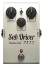 | SABdriver| 14 SAB Driver  | [Wampler Plexi-Drive](https://effector-hakase.com/overdrive/10917/)| VOLUME  | TONE  | DRIVE  |
  
## 4.AMP
つまみは全機種共通で、「GAIN、BASS、MIDDLE、TREBLE、VOLUME」の５つ。  
  
| No | images | DSP ID | AMP | 参照モデル | カテゴリ | 目安 | memo |
|----|--------|-------------------|-----------------------|------------------------------|-----------|------|------|
| 1  |  | RolandJC120 | 01 Silver 120| Roland JC120  | Clean  | ○○○○ ||
| 2  |  | Twin  | 02 Black Duo | Fender Twin Reverb  | Clean  | ○○○○ ||
| 3  |  | ADClean  | 03 AD Clean  | Orange AD 30  | Clean  | ○○○○ ||
| 4  | 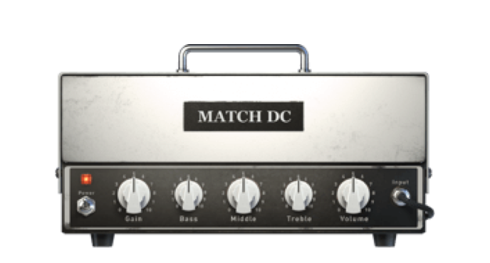 | 94MatchDCV2 | 04 MATCH DC  | Matchless DC30| Clean  | ○○○○ ||
| 5  | 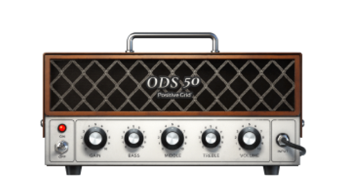 | ODS50CN  | 05 ODS 50 | Dumble ODS 50 HRM| Clean  | ○○○○ ||
| 6  | 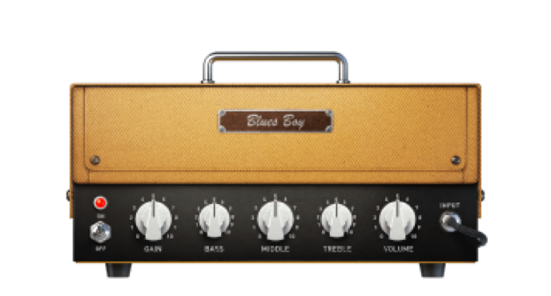 | BluesJrTweed| 08 Blues Boy | Fender Blues Junior | Crunch | ●●○○ ||
| 7  |  | Bassman  | 09 Tweed Bass| Fender Bassman| Glassy | ●○○○ ||
| 8  | 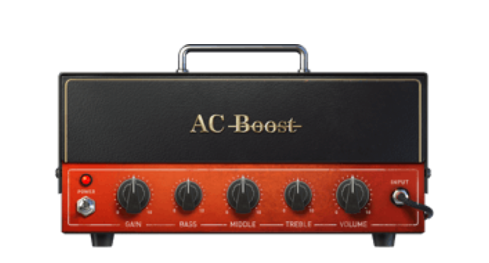 | AC Boost | 10 AC Boost  | Vox AC30| Glassy | ●○○○ ||
| 9  | 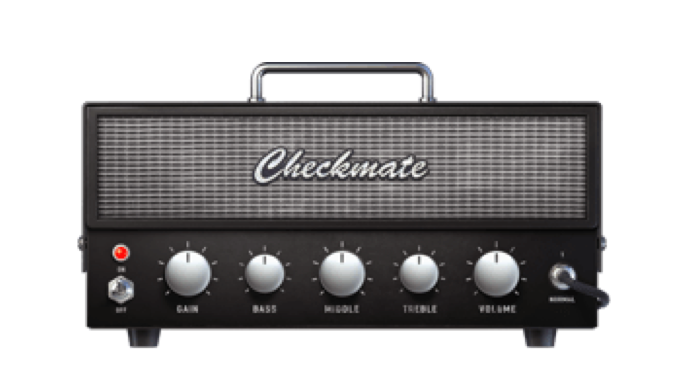 | Checkmate| 11 Checkmate | Teisco Checkmate20  | Glassy | ●○○○ ||
| 10 | 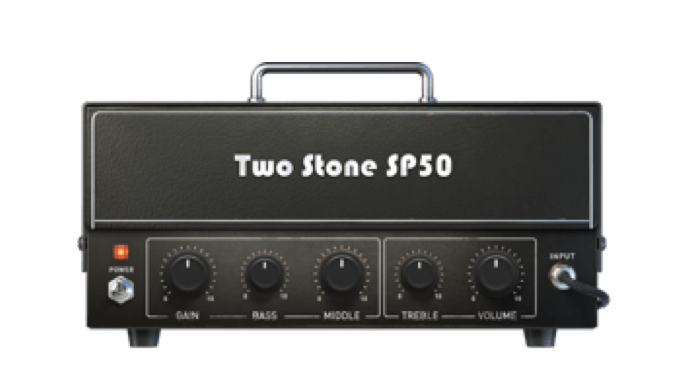 | TwoStoneSP50| 12 Two Stone SP50  | Two Rock Studio Pro 50 | Glassy | ●○○○ ||
| 11 |  | Deluxe65 | 15 American Deluxe | Fender ’57 Custom Deluxe  | Crunch | ●●○○ ||
| 12 | 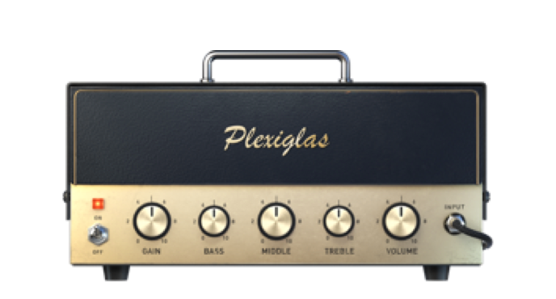 | Plexi | 16 Plexiglas | Marshall Super Lead 100| Crunch | ●●○○ ||
| 13 |  | OverDrivenJM45 | 17 JM45| Marshall JTM45| Crunch | ●●○○ ||
| 14 |  | OverDrivenLuxVerb | 18 Lux Verb  | Fender Deluxe Reverb| Crunch | ●●○○ ||
| 15 | 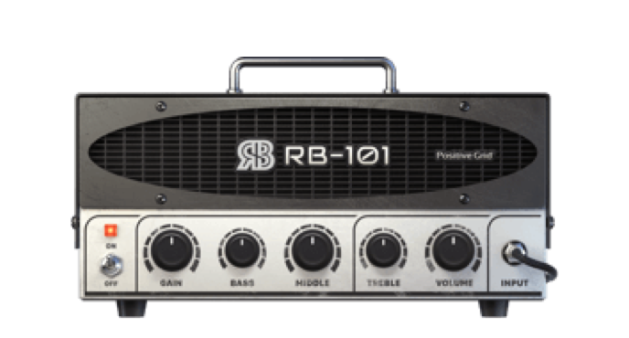 | Bogner| 21 RB 101 | Bogner Ecstasy 101  | High Gain | ●●●○ ||
| 16 | 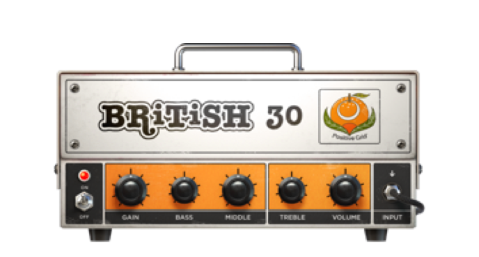 | OrangeAD30  | 22 British 30| Orange AD30| High Gain | ●●●○ ||
| 17 | 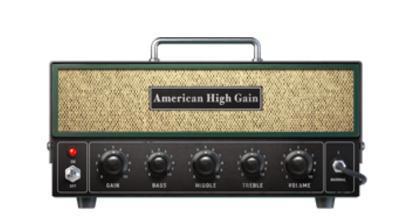 | AmericanHighGain  | 23 American High Gain | Mesa Boogie JP-2C| High Gain | ●●●○ ||
| 18 | 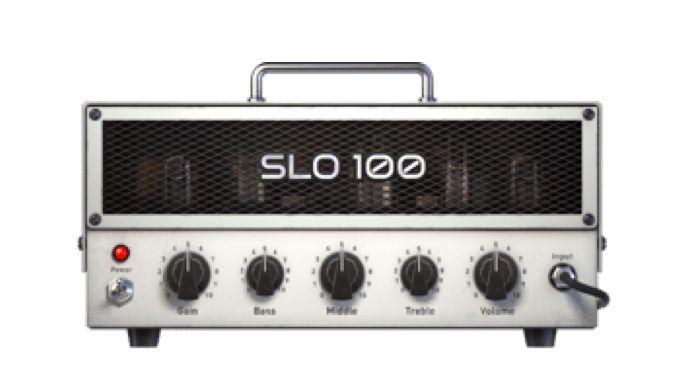 | SLO100| 24 SLO 100| Soldano SLO-100  | High Gain | ●●●○ ||
| 19 |  | YJM100| 25 YJM100 | Marshall YJM100 Signature | High Gain | ●●●○ ||
| 20 |  | Rectifier| 26 Treadplate| Mesa Boogie Triple Rectifier | Metal  | ●●●● ||
| 21 | 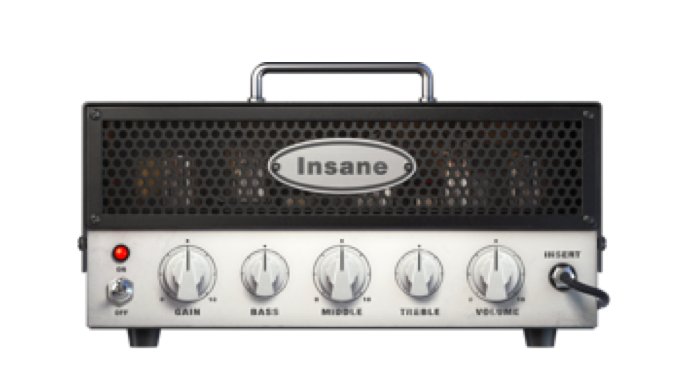 | EVH| 27 Insane | EVH 5150 III  | Metal  | ●●●● ||
| 22 | 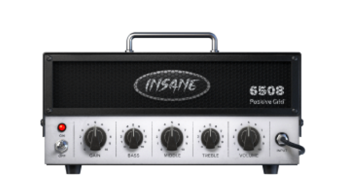 | 6505Plus | 28 Insane 6508  | Peavey 6505| Metal  | ●●●● ||
| 23 |  | SwitchAxeLead  | 29 SwitchAxe | H&K Switch Blade | Metal  | ●●●● ||
| 24 | 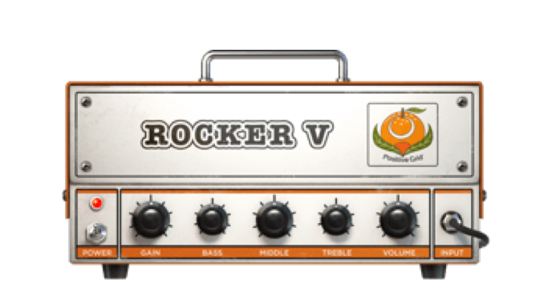 | Invader  | 30 Rocker V  | Orange Rockerverb 50| Metal  | ●●●● ||
| 25 | 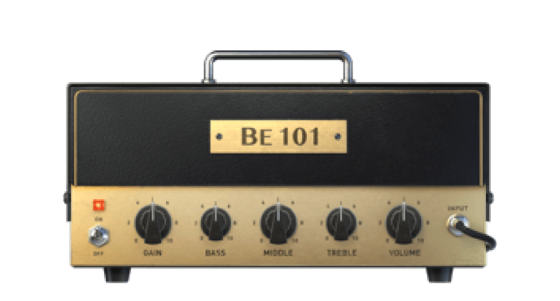 | BE101 | 31 BE 101 | Friedman BE100| Metal  | ●●●● ||
| 26 |  | Acoustic | 32 Pure Acoustic| PG Original| Acoustic  |||
| 27 |  | AcousticAmpV2  | 33 Fishboy| Fishman Acoustic Amp| Acoustic  |||
| 28 | 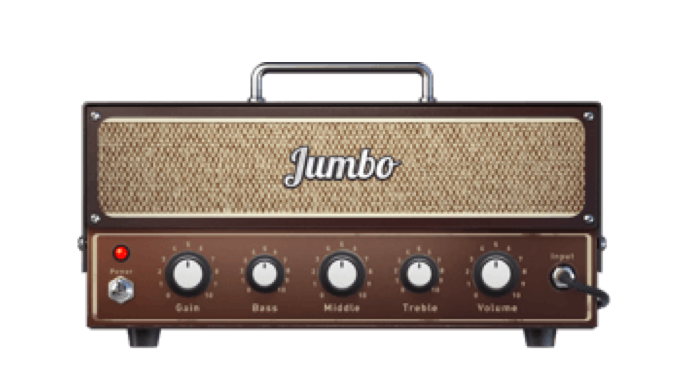 | FatAcousticV2  | 34 Jumbo  | PG Original| Acoustic  |||
| 29 |  | FlatAcoustic| 35 Flat Acoustic| PG Original| Acoustic  |||
| 30 | 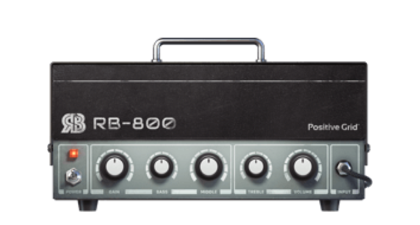 | GK800 | 36 RB-800 | Gallien-Krueger 800RB  | Bass|||
| 31 |  | Sunny3000| 37 Sunny 3000| Sunn 300T  | Bass|||
| 32 |  | W600  | 38 W600| Eden WTP600| Bass|||
| 33 |  | Hammer500| 39 Hammer 500| Aguilar Tone Hammer 500| Bass|
  
## 5.MOD/EQ
  
| No | Images | DSP ID | MOD/EQ | 参照モデル | index 0 | index 1 | index 2 | index 3 | index 4 | index 5 | index 6 |
|----|--------|---------------|-------------------|---------------------------------------|----------------|------------------|----------------|----------------|----------------|----------------|----------------|
| 1  |  | Tremolo | 01 Tremolo  | [Mad Professor Mellow Yellow](https://kcmusic.jp/mpamp/1332)  | SPEED | DEPTH| LEVEL | | | | |
| 2  |  | ChorusAnalog  | 02 Chorus| [Boss CH-1 Super Chorus](https://www.boss.info/jp/products/ch-1/) | E.LEVEL  | RATE | DEPTH | TONE  | | | |
| 3  |  | Flanger | 03 Flanger  | [Electro Harmonix Electric Mistress](https://kcmusic.jp/ehx/sem/) | RATE  | MIX  | DEPTH | | | | |
| 4  |  | Phaser  | 04 Phaser| [MXR M-107 Phase 100](https://moridaira.co.jp/posts/mxr-m107) | SPEED | INTENSITY  | | | | | |
| 5  |  | Vibrato01  | 05 Vibrato  | [BBE Mind Bender (vibrato switch only)](http://jabe-guitar.shop-pro.jp/?pid=173256785) | SPEED | DEPTH| | | | | |
| 6  |  | UniVibe | 06 UniVibe  | [Shi-Nei Uni-vibe](https://tgr-guitar.com/effector/tremolo-uni-vibe.html) | SPEED | Chorus / Vibrato | INTENSITY| | | | |
| 7  |  | Cloner  | 08 Cloner Chorus  | [Electro Harmonix Small Clone](https://kcmusic.jp/ehx/smallclone/) | RATE  | DEPTH HIGH / LOW | | | | | |
| 8  |  | MiniVibe| 09 Classic Vibe| [Voodoo Lab Micro Vibe](https://www.digimart.net/cat13/shop5155/DS08555508/)  | SPEED | INTENSITY  | | | | | |
| 9  |  | Tremolator | 10 Tremolator  | [Demeter TRM-1 Tremulator](https://umbrella-company.jp/products/trm-1-tremulator/)  | Depth | Speed| BPM| | | | |
| 10 |  | TremoloSquare | 11 Tremolo Square | [TC Electronic Pipelilne](https://electori.co.jp/tcelectronic/PIPELINE_TAP_TREMOLO.htm)| SPEED | DEPTH| LEVEL | | | | |
| 11 |  | GuitarEQ6  | 12 Guitar EQ| [MXR M109](https://www.watanabe-mi.com/honten/list/p90832/)| LEVEL | 100Hz| 200Hz | 400Hz | 800Hz | 1.6kHz| 3.2kHz|
| 12 |  | BassEQ6 | 13 Bass EQ  | MXR M109| LEVEL | 50Hz | 120Hz | 400Hz | 800Hz | 4.5kHz| 10kHz |
  
## 6.DELAY
  
| No | Images | DSP ID | DELAY | 参照モデル | index 0 | index 1 | index 2 | index 3 | index 4 |
|----|--------|----------------|------------------|---------------------------------------|----------------|----------------|----------------|----------------|----------------|
| 1  |  | DelayMono | 01 Digital Delay | Boss DD-3 Digital Delay | E.LEVEL | F.BACK | D.TIME | MODE | BPM |
| 2  |  | DelayEchoFilt  | 02 Echo Filt  | Marshall Echohead EH-1 | DELAY | FEED BACK| LEVEL | TONE  | BPM|
| 3  |  | VintageDelay| 03 Vintage Delay | Boss DM-3  | REPEAT RATE | INTENSITY| ECHO  | BPM| |
| 4  |  | DelayReverse| 04 Reverse Delay | Positive Grid original | MIX| DECAY | FILTER| TIME  | BPM|
| 5  |  | DelayMultiHead | 05 Multi Head | Boss RE-20 / Roland RE-201 Space Echo | REPEAT RATE | INTENSITY| ECHO VOL.| MODE SELECTOR  | BPM|
| 6  |  | DelayRe201  | 06 Echo Tape  | Maestro Echoplex EP-2 Tape Delay| SUSTAIN  | VOLUME| TONE  | SHORT/LONG  | BPM|  
  
## 7.REVERB
つまみは全機種共通で、「LEVEL、DAMPING、DWELL、TIME、LOW CUT、HIGH CUT」の６つ。  
  
| No | Images | DSP ID | REVERB | 参照モデル | memo |
|----|--------|-------------|------------------|------------------------------------|------|
| 1  |  | bias.reverb | 01 Room Studio A |||
| 2  |  | bias.reverb | 02 Chamber |||
| 3  | 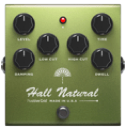 | bias.reverb | 03 Hall Natural  |||
| 4  |  | bias.reverb | 04 Plate Short|||
| 5  |  | bias.reverb | 05 Hall Ambient  |||
| 6  |  | bias.reverb | 06 Plate Rich | EMT 140 Plate Reverb||
| 7  |  | bias.reverb | 07 Hall Medium| Electro Harmonix Holy Grail Reverb ||
| 8  |  | bias.reverb | 08 Plate Long | Wampler Reflection Plate Reverb ||
| 9  | 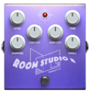 | bias.reverb | 09 Room Studio B |
  
[戻る](./README.md)
