# SparkApp
## 1.GATE
  
| No | images | DSP ID         | Name       | index 0 | index 1 | index 2 |
|----|--------|----------------|------------|-----------|--------|----|
| 1  | 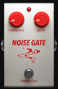 | bias.noisegate | NOISE GATE | Threshold | Decay | 不明 |
  
## 2.COMP/WAH
  
| No | Images | dspId          | COMP/WAH        | 参照モデル                       | index 0 | index 1        | index 2          | index 3 |
|----|--------|----------------|-----------------|-----------------------------|---------|----------------|------------------|---------|
| 1  | 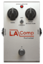       | LA2AComp       | 01 LA Comp      | Teletronix LA-2A Compressor | GAIN    | PEAK REDUCTION | LIMIT / COMPRESS |         |
| 2  | 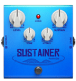       | BlueComp       | 02 Sustain Comp | Boss CS-3                   | LEVEL   | TONE           | ATTACK           | SUSTAIN |
| 3  | 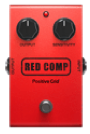       | Compressor     | 03 Red Comp     | MXR Dyna Comp               | OUTPUT  | SENSITIVITY    |                  |         |
| 4  | 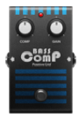       | BassComp       | 04 Bass Comp    | EBS Multicomp               | COMP    | GAIN           |                  |         |
| 5  | 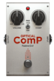       | BBEOpticalComp | 05 Optical Comp | BBE Opto Stomp              | VOLUME  | COMP           | PAD(-15dB/0dB)   |
  
## 3.DRIVE

| No | Images | DSP ID | DRIVE | 参照モデル | index 0 | index 1 | index 2 |
|----|--------|-------------------|----------------|-----------------------------------|------------|-------------|-----------|
| 1  | 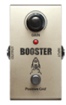       | Booster           | 01 Booster     | MXR Micro Amp                     | GAIN       |             |           |
| 2  | 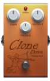       | KlonCentaurSilver | 02 Clone Drive | Klon Centaur                      | OUTPUT     | TREBLE      | GAIN      |
| 3  | 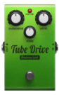       | DistortionTS9     | 03 Tube Drive  | Ibanez Tube Screamer              | OVERDRIVE  | TONE        | LEVEL     |
| 4  | 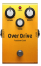       | Overdrive         | 04 Over Drive  | Boss OD-3                         | LEVEL      | TONE        | DRIVE     |
| 5  | 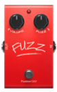       | Fuzz              | 09 Fuzz Face   | Dunlop or Arbiter Fuzz Face       | VOLUME     | FUZZ        |           |
| 6  | 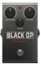       | ProCoRat          | 10 Black Op    | Pro Co RAT                        | DISTORTION | FILTER      | VOLUME    |
| 7  | 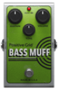       | BassBigMuff       | 11 Bass Muff   | Electro Harmonix Bass Big Muff Pi | VOLUME     | TONE        | SUSTAIN   |
| 8  | 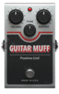       | GuitarMuff        | 12 Guitar Muff | Electro Harmonix Big Muff         | VOLUME     | TONE        | SUSTAIN   |
| 9  | 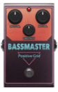       | MaestroBassmaster | 13 Bassmaster  | Maestro Bass Brassmaster          | BRASS VOL. | SENSITIVITY | BASS VOL. |
| 10 | 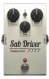       | SABdriver         | 14 SAB Driver  | Wampler Plexi-Drive               | VOLUME     | TONE        | DRIVE     |
  
## 4.AMP
  
| No | images | dspId             | Amp                   | 参照モデル                        | カテゴリ      | 目安   | memo |
|----|--------|-------------------|-----------------------|------------------------------|-----------|------|------|
| 1  | 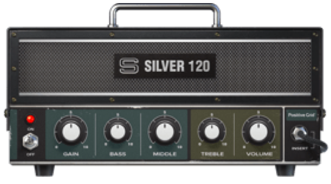       | RolandJC120       | 01 Silver 120         | Roland JC120                 | Clean     | ○○○○ |      |
| 2  | 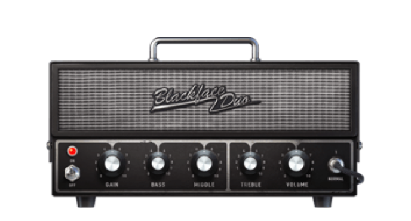       | Twin              | 02 Black Duo          | Fender Twin Reverb           | Clean     | ○○○○ |      |
| 3  | 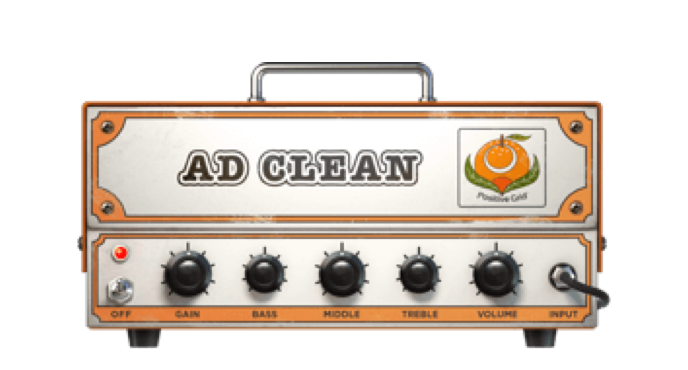       | ADClean           | 03 AD Clean           | Orange AD 30                 | Clean     | ○○○○ |      |
| 4  | 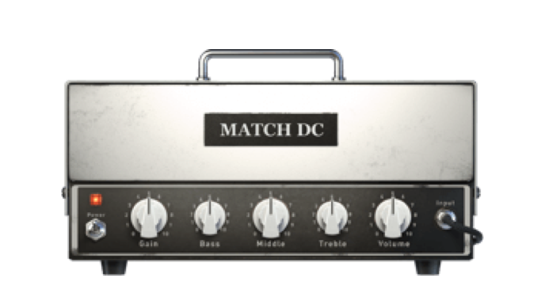       | 94MatchDCV2       | 04 MATCH DC           | Matchless DC30               | Clean     | ○○○○ |      |
| 5  | 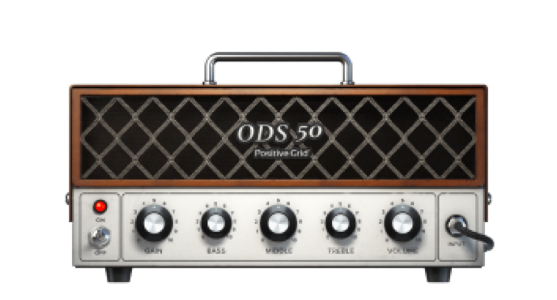       | ODS50CN           | 05 ODS 50             | Dumble ODS 50 HRM            | Clean     | ○○○○ |      |
| 6  | 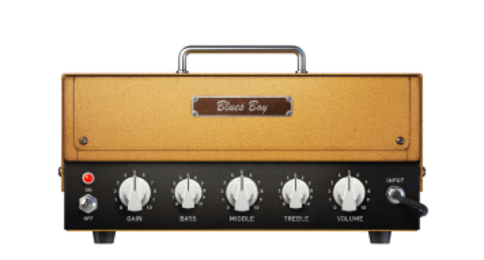       | BluesJrTweed      | 08 Blues Boy          | Fender Blues Junior          | Crunch    | ●●○○ |      |
| 7  | 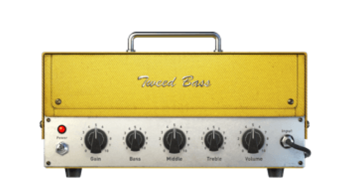       | Bassman           | 09 Tweed Bass         | Fender Bassman               | Glassy    | ●○○○ |      |
| 8  | 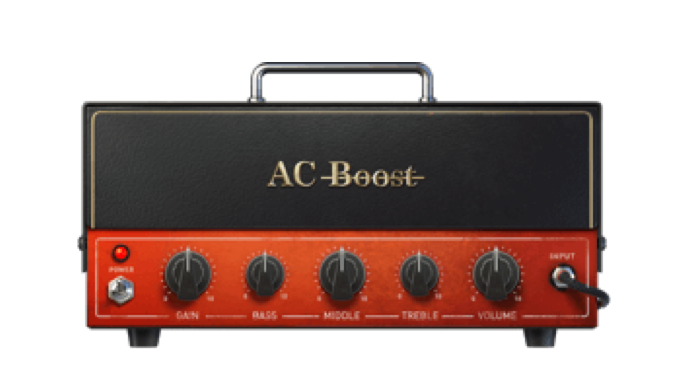       | AC Boost          | 10 AC Boost           | Vox AC30                     | Glassy    | ●○○○ |      |
| 9  | 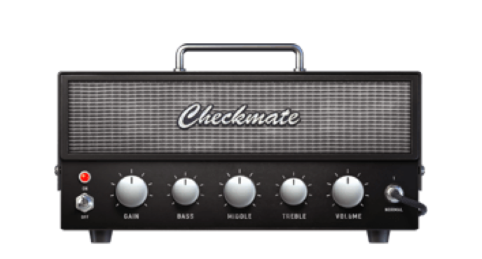       | Checkmate         | 11 Checkmate          | Teisco Checkmate20           | Glassy    | ●○○○ |      |
| 10 | 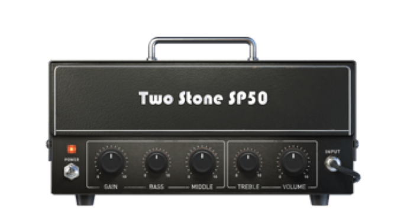       | TwoStoneSP50      | 12 Two Stone SP50     | Two Rock Studio Pro 50       | Glassy    | ●○○○ |      |
| 11 | 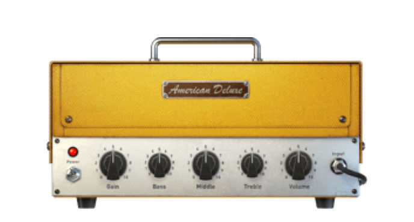       | Deluxe65          | 15 American Deluxe    | Fender ’57 Custom Deluxe     | Crunch    | ●●○○ |      |
| 12 | 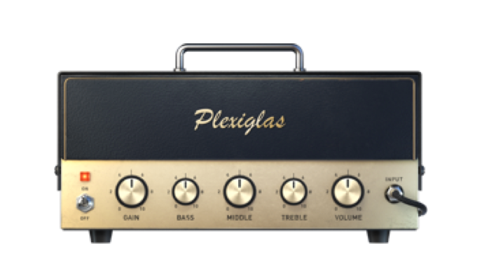       | Plexi             | 16 Plexiglas          | Marshall Super Lead 100      | Crunch    | ●●○○ |      |
| 13 | 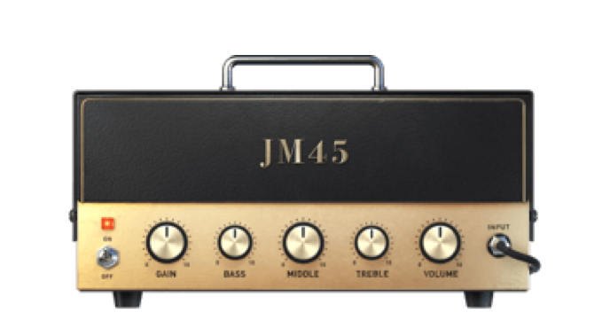       | OverDrivenJM45    | 17 JM45               | Marshall JTM45               | Crunch    | ●●○○ |      |
| 14 | 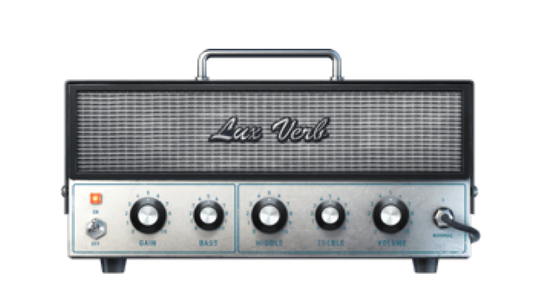       | OverDrivenLuxVerb | 18 Lux Verb           | Fender Deluxe Reverb         | Crunch    | ●●○○ |      |
| 15 | 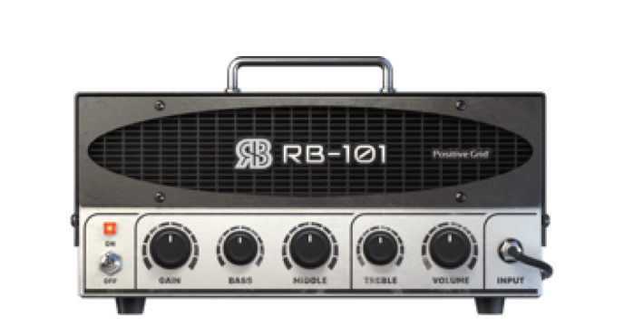       | Bogner            | 21 RB 101             | Bogner Ecstasy 101           | High Gain | ●●●○ |      |
| 16 | 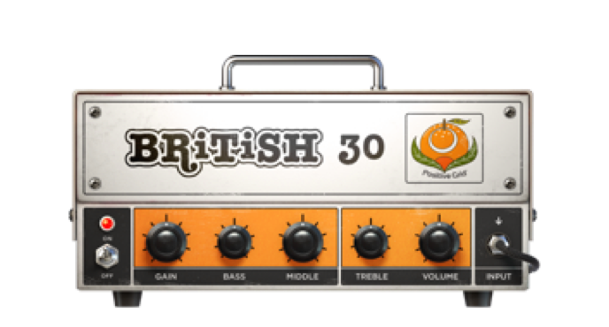       | OrangeAD30        | 22 British 30         | Orange AD30                  | High Gain | ●●●○ |      |
| 17 | 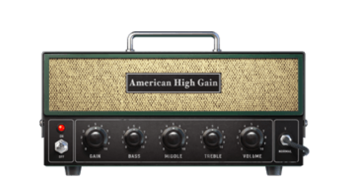       | AmericanHighGain  | 23 American High Gain | Mesa Boogie JP-2C            | High Gain | ●●●○ |      |
| 18 | 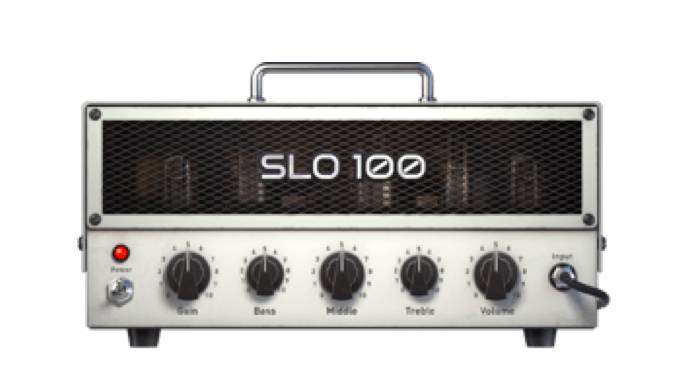       | SLO100            | 24 SLO 100            | Soldano SLO-100              | High Gain | ●●●○ |      |
| 19 | 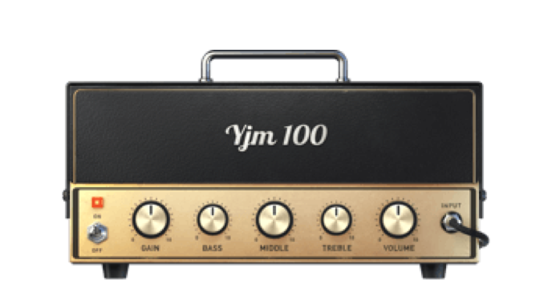       | YJM100            | 25 YJM100             | Marshall YJM100 Signature    | High Gain | ●●●○ |      |
| 20 | 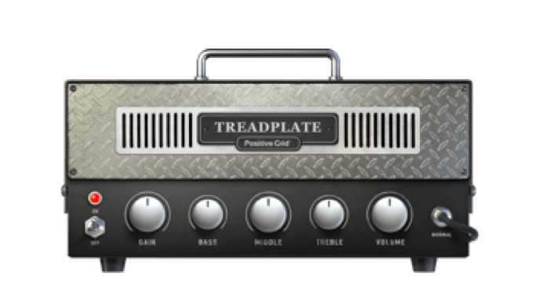       | Rectifier         | 26 Treadplate         | Mesa Boogie Triple Rectifier | Metal     | ●●●● |      |
| 21 | 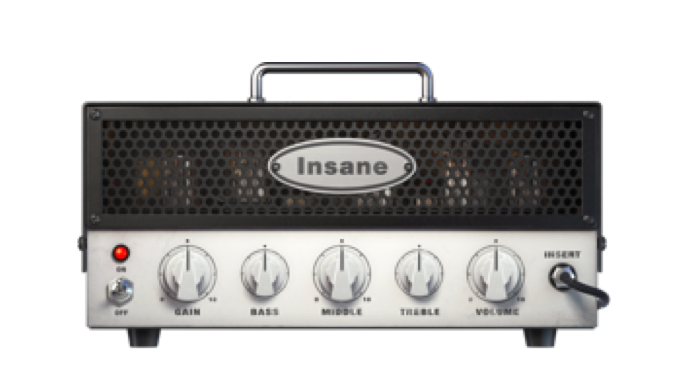       | EVH               | 27 Insane             | EVH 5150 III                 | Metal     | ●●●● |      |
| 22 | 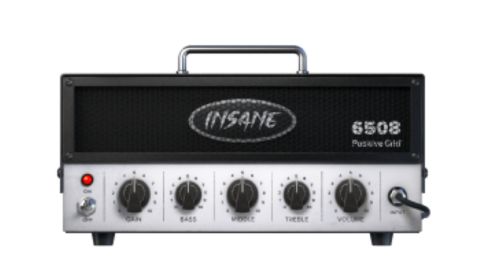       | 6505Plus          | 28 Insane 6508        | Peavey 6505                  | Metal     | ●●●● |      |
| 23 | 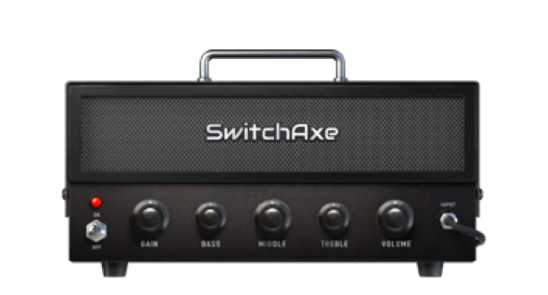       | SwitchAxeLead     | 29 SwitchAxe          | H&K Switch Blade             | Metal     | ●●●● |      |
| 24 | 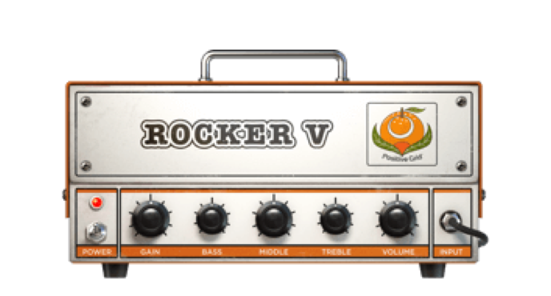       | Invader           | 30 Rocker V           | Orange Rockerverb 50         | Metal     | ●●●● |      |
| 25 | 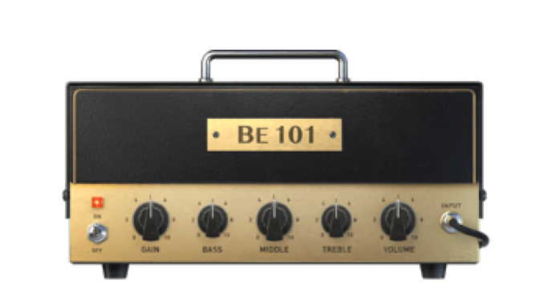       | BE101             | 31 BE 101             | Friedman BE100               | Metal     | ●●●● |      |
| 26 | 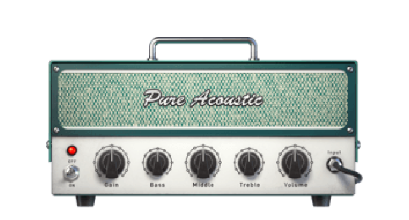       | Acoustic          | 32 Pure Acoustic      | PG Original                  | Acoustic  |      |      |
| 27 |        | AcousticAmpV2     | 33 Fishboy            | Fishman Acoustic Amp         | Acoustic  |      |      |
| 28 | 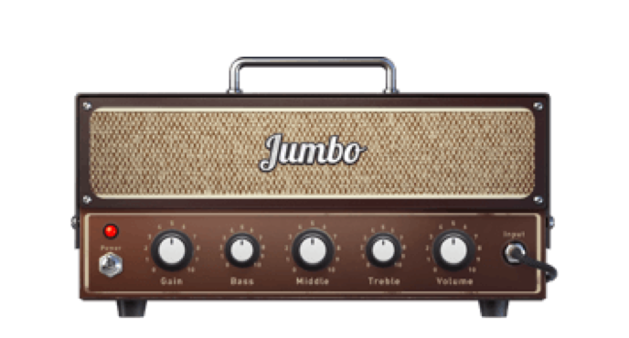       | FatAcousticV2     | 34 Jumbo              | PG Original                  | Acoustic  |      |      |
| 29 |        | FlatAcoustic      | 35 Flat Acoustic      | PG Original                  | Acoustic  |      |      |
| 30 | 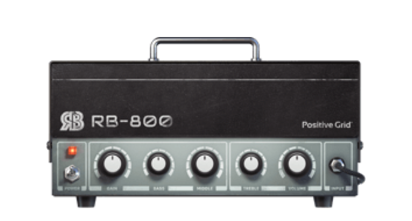       | GK800             | 36 RB-800             | Gallien-Krueger 800RB        | Bass      |      |      |
| 31 | 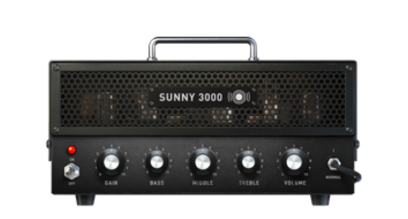       | Sunny3000         | 37 Sunny 3000         | Sunn 300T                    | Bass      |      |      |
| 32 | 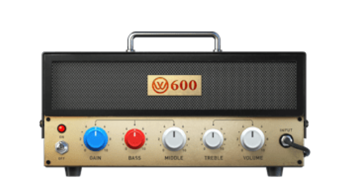       | W600              | 38 W600               | Eden WTP600                  | Bass      |      |      |
| 33 | 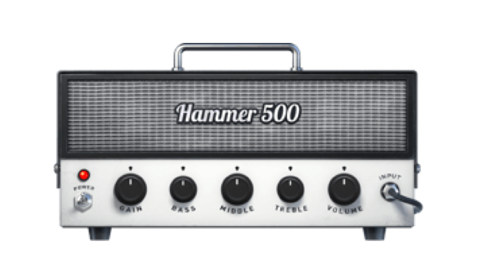       | Hammer500         | 39 Hammer 500         | Aguilar Tone Hammer 500      | Bass      |

